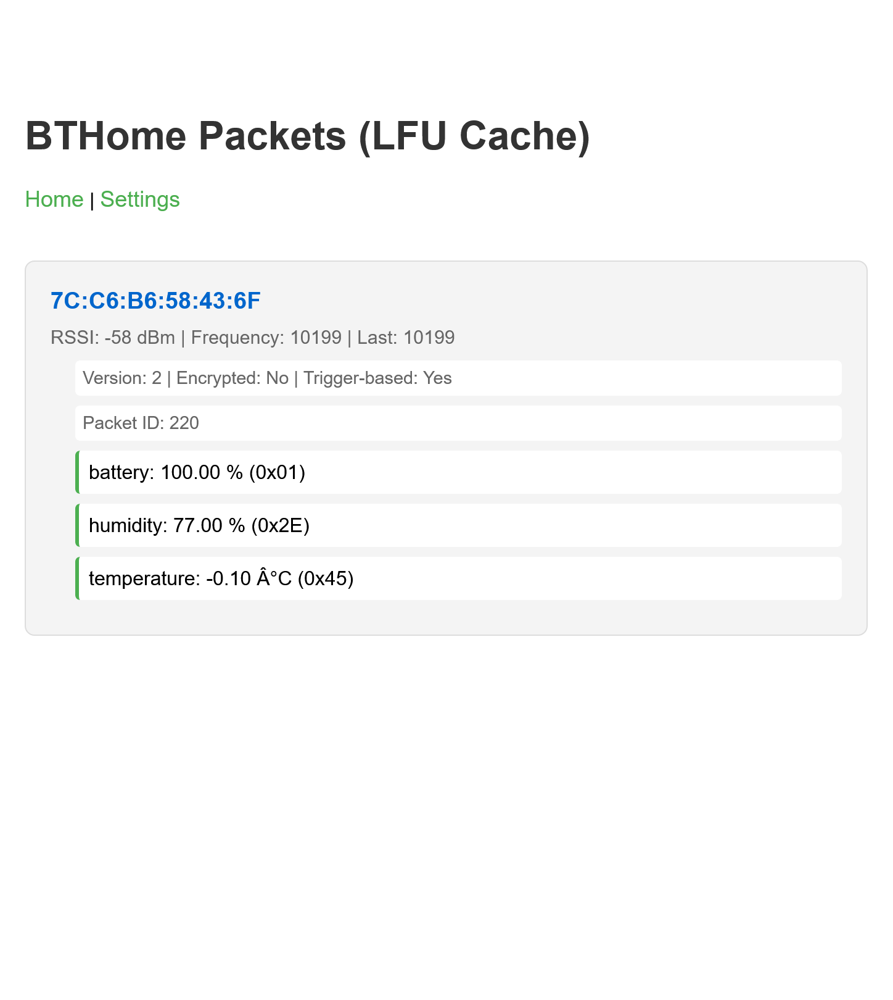
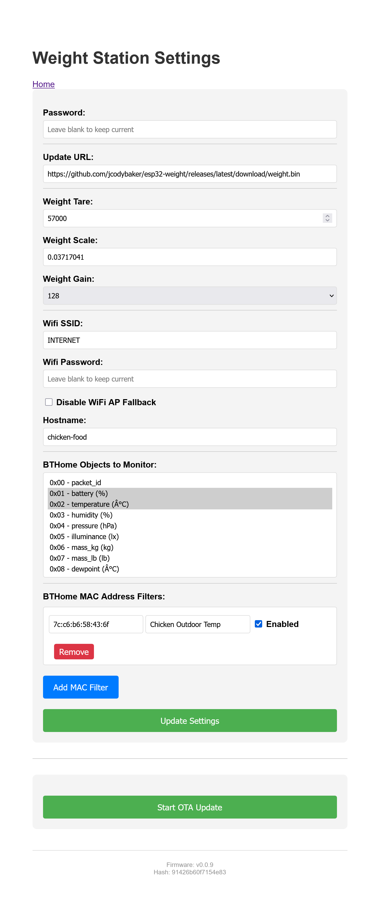

# BTHome Prometheus Collector/Exporter + Local Sensor Platform

This project provides a firmware image for esp32-based devices which can relay [bthome](https://bthome.io) measurements from Bluetooth-low-energy (BLE) and export them as prometheus metrics. Additionally, it exports measurements from a local load-cell (HX711) sensor, DS18B20 temperatures sensors, [Atlas Scientific EZO-PMP](https://atlas-scientific.com/peristaltic/ezo-pmp/), as well operational data about the device.

## Features
* Filtering BTHome metrics based on measurement type and MAC address
* BTHome scanning mode
* Assign friendly names to BTHome devices
* Read weight measurements from an attached HX711 load-cell sensor
* Configurable WiFi connectivity with AP mode for configuration
* Password protection for settings
* Over-the-air updates
* Log to remote syslog server

## Links
* [BTHome](https://bthome.io)
* [ESP-IDF HX711 Driver](https://components.espressif.com/components/esp-idf-lib/hx711/versions/1.0.6/readme?language=en)
* [My BTHome Driver](https://components.espressif.com/components/jcodybaker/bthome/)
* [Atlas Scientific EZO-PMP](https://atlas-scientific.com/peristaltic/ezo-pmp/)

## Screenshots



### Metrics Example:
```
# HELP weight_grams Current weight reading in grams
# TYPE weight_grams gauge
weight_grams{hostname="chicken-food"} 7258.04
# HELP weight_raw Current weight reading in raw units
# TYPE weight_raw gauge
weight_raw{hostname="chicken-food"} 252264
# HELP wifi_rssi_dbm WiFi signal strength in dBm
# TYPE wifi_rssi_dbm gauge
wifi_rssi_dbm{hostname="chicken-food"} -40
# HELP uptime_seconds System uptime in seconds
# TYPE uptime_seconds counter
uptime_seconds{hostname="chicken-food"} 55888
# HELP bthome_rssi_dbm BTHome device signal strength in dBm
# TYPE bthome_rssi_dbm gauge
bthome_rssi_dbm{hostname="chicken-food",device="Chicken Outdoor Temp",mac="7c:c6:b6:58:43:6f"} -59
# HELP bthome_battery BTHome battery in percent
# TYPE bthome_battery gauge
bthome_battery{hostname="chicken-food",device="Chicken Outdoor Temp",mac="7c:c6:b6:58:43:6f"} 100.00
# HELP bthome_temperature BTHome temperature in degrees_celsius
# TYPE bthome_temperature gauge
bthome_temperature{hostname="chicken-food",device="Chicken Outdoor Temp",mac="7c:c6:b6:58:43:6f"} -0.10
```

## Hardware
For my purposes I've used an [M5Stack Atom Lite ESP32 Dev Kit](https://shop.m5stack.com/products/atom-lite-esp32-development-kit), but similar ESP32-based devices should work.

For local weight sensing I've used a [ShangHJ 4 Sets Digital Load Cell Weight Sensor + HX711 ADC Module](https://www.amazon.com/dp/B09VYVMRWZ?ref=ppx_yo2ov_dt_b_fed_asin_title) kit from Amazon. A wiring diagram is included in the product photos.

For BTHome sensors I've been using Shelly's:
* [BLU H&T Humidity/Temperature sensor](https://us.shelly.com/blogs/documentation/shelly-blu-h-t)
* [BLU Distance](https://us.shelly.com/blogs/documentation/shelly-blu-distance)


## TODO
* Publish to MQTT
* BTHome Encryption Support
